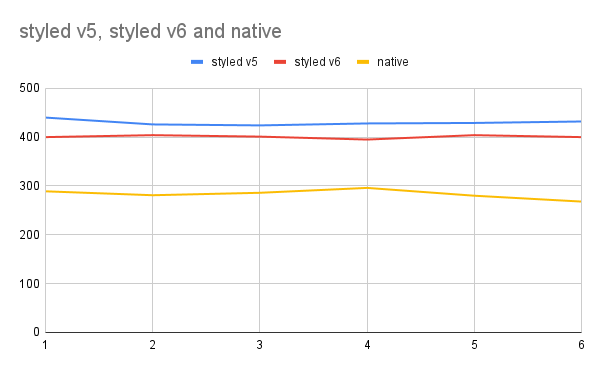

# styled-components/native Performance Reproduction

This is a Expo App reproducer to demonstrate the performance difference between using styled-components/native, and built-in styling.

1000 items are rendered in Array.map to simulate the complexity of a real app.

Please not, this simple benchmark is not exhaustive, and not representative of a real app.
For precise testing, we must testing in production mode, on hardware.

However, since styled-components does work at runtime to convert this back to normal styles, there will always be an overheard when compared to plain StyleSheet.create()

## Results - Styled v Native Render Time 1000 Empty Views (ms)

|           | 1   | 2   | 3   | 4   | 5   | 6   | Avg | % Slowdown |
|-----------|-----|-----|-----|-----|-----|-----|-----|------------|
| Native    | 289 | 281 | 286 | 296 | 280 | 268 |  283 | 0          |
| Styled v5 | 440 | 426 | 424 | 428 | 429 | 432 |  429 | 41.0       |
| Styled v6 | 400 | 404 | 401 | 395 | 404 | 400 | 400 | 34.2       |

# Reproduction Steps
1. Start the profiler by pressing Shift + M and open React Dev Tools.
2. Open profiler and hit record
3. Press the toggle button and stop recording
4. Record the time to render App.ts
5. Average the result across at least 3 runs

